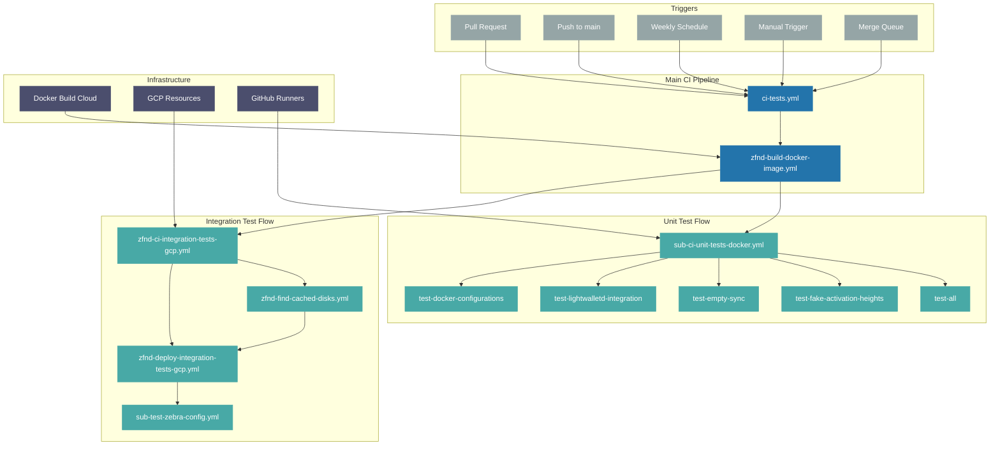

# Zebra CI/CD Architecture

This document provides a comprehensive overview of Zebra's Continuous Integration and Continuous Deployment (CI/CD) system. It serves as a guide for contributors, maintainers, and new team members.

## Table of Contents

1. [System Overview](#system-overview)
2. [CI/CD Workflow Diagram](#cicd-workflow-diagram)
3. [Core Infrastructure](#core-infrastructure)
4. [Workflow Organization](#workflow-organization)
5. [Test Execution Strategy](#test-execution-strategy)
6. [Infrastructure Details](#infrastructure-details)
7. [Best Practices](#best-practices)
8. [Known Issues](#known-issues)

## System Overview

Zebra's CI/CD system is built on GitHub Actions, providing a unified platform for automation. The system ensures code quality, maintains stability, and automates routine tasks through specialized workflows.

## CI/CD Workflow Diagram

Below is a Mermaid diagram illustrating how our CI workflows relate to each other, with a focus on parallel execution patterns and job dependencies. The diagram shows the main CI pipeline, integration test flow, unit test flow, underlying infrastructure, and the various triggers that initiate the pipeline.



*The diagram above illustrates the parallel execution patterns in our CI/CD system. All triggers can initiate the pipeline concurrently, unit tests run in parallel after the Docker image build, and integration tests follow a mix of parallel and sequential steps. The infrastructure components support their respective workflow parts concurrently.*

## Core Infrastructure

### 1. GitHub Actions

- Primary CI/CD platform
- Workflow automation and orchestration
- Integration with other services

### 2. Infrastructure as Code

- Uses [Cloud Foundation Fabric](https://github.com/ZcashFoundation/cloud-foundation-fabric) for GCP infrastructure
- Terraform-based architecture, networking, and permissions
- Resources (VMs, Disks, Images, etc.) deployed via GitHub Actions pipelines

### 3. Build and Registry Services

#### Docker-based Testing

- Most tests run in containers defined by our [Dockerfile](http://../../docker/Dockerfile)
- The [entrypoint script](http://../../docker/entrypoint.sh) manages:
  - Test execution
  - Environment configuration
  - Resource cleanup

#### [Docker Build Cloud](https://www.docker.com/products/build-cloud/)

- Optimized build times (~10 min for non-cached, ~30 sec for cached)
- More efficient than GitHub Runners
- Addresses [Rust caching limitations](https://github.com/ZcashFoundation/zebra/issues/6169#issuecomment-1712776391)

#### Container Registries

- Google Cloud Registry: Internal CI artifacts
- [Docker Hub](https://hub.docker.com/): Public release artifacts
- Ensures proper artifact distribution

### 4. Test Infrastructure

#### GitHub-hosted Runners

- All Unit Tests jobs
- Standard CI/CD operations
- Limited to 6-hour runtime

#### Self-hosted Runners (GKE)

- All Integration Tests jobs (deployed to GCP)
- Support for tests exceeding 6 hours
- Extended logging capabilities
- Full GitHub Actions console integration

**Note**: Self-hosted Runners are just used to keep the logs running in the GitHub Actions UI for over 6 hours, the Integration Tests are not run in the Self-hosted Runner itself, but in the deployed VMs in GCP through GitHub Actions.

### 5. Queue Management

[Mergify](https://mergify.yml)

- Automated PR merging and queue-based testing
- Priority management
- Ensures code quality before merge
- See our [`.mergify.yml`](http://../../.mergify.yml) for configuration

## Workflow Organization

### Main Workflows

- **CI Tests** (`ci-*.yml`): Core testing workflows
  - Unit tests
  - Integration tests
  - Code coverage
  - Linting
- **CD Deployments** (`cd-*.yml`): Deployment workflows
  - Node deployment to GCP
  - Documentation deployment
- **Release Management** (`release-*.yml`): Version and release workflows

### Supporting Workflows

- **Sub-workflows** (`sub-*.yml`): Reusable workflow components
  - Docker image building
  - Test configurations
  - GCP resource management
- **Patch Workflows** (`*.patch.yml`, `*.patch-external.yml`): Handle GitHub Actions limitations for required checks

### Patch Workflows Rationale

Our use of patch workflows (`.patch.yml` and `.patch-external.yml`) is a workaround for a [known limitation in GitHub Actions](https://github.com/orgs/community/discussions/44490) regarding path filters and required checks. When a workflow is marked as required for PR merging:

1. **Path Filtering Limitation**: GitHub Actions does not properly handle the case where a required workflow is skipped due to path filters. Instead of marking the check as "skipped" or "passed", it remains in a "pending" state, blocking PR merges.  

2. **Our Solution**: We maintain parallel "patch" workflows that:  

   - Run without path filters  
   - Contain minimal steps that always pass when the original workflow would have been skipped  
   - Allow PRs to merge when changes don't affect relevant paths

3. **Impact**:  

   - Doubled number of workflow files to maintain  
   - Additional complexity in workflow management  
   - Extra status checks in PR UI

## Test Execution Strategy

### Test Orchestration with Nextest

Our test execution is centralized through our Docker [entrypoint script](http://../../docker/entrypoint.sh) and orchestrated by `cargo nextest`. This provides a unified and efficient way to run tests both in CI and locally.

#### Nextest Profile-driven Testing

We use `nextest` profiles defined in [`.config/nextest.toml`](../../.config/nextest.toml) to manage test suites. A single environment variable, `NEXTEST_PROFILE`, selects the profile to run.

```bash
# Run the full test suite using the 'all-tests' profile
docker run --rm -e NEXTEST_PROFILE=all-tests zebra-tests

# Run a specific test suite, like the lightwalletd integration tests
docker run --rm -e NEXTEST_PROFILE=lwd-integration zebra-tests
```

#### Test Categories

Our tests are organized into different categories:

- **Unit & Integration Tests**: Basic functionality and component testing
- **Network Sync Tests**: Testing blockchain synchronization from various states
- **Lightwalletd Tests**: Integration with the lightwalletd service
- **RPC Tests**: JSON-RPC endpoint functionality
- **Checkpoint Tests**: Blockchain checkpoint generation and validation

Each test category has specific profiles that can be run individually using the `NEXTEST_PROFILE` environment variable.


### Pull Request Testing

#### Continuous Validation

- Tests run automatically on each commit
- Contributors get immediate feedback on their changes
- Regressions are caught early in the development process
- Reduces manual testing burden on reviewers

#### Fast Feedback Loop

- Linting: Code style and formatting
- Unit tests: Function and component behavior
- Basic integration tests: Core functionality
- All results are reported directly in the PR interface

#### Deep Validation

- Full integration test suite
- Cross-platform compatibility checks
- Performance benchmarks
- State management validation

### Scheduled Testing

Weekly runs include:

- Full Mainnet synchronization
- Extended integration suites
- Resource cleanup

## Infrastructure Details

### VM-based Test Infrastructure

#### Test-specific Requirements

- Some integration tests need a fully synced network
- Certain tests validate against specific chain heights
- Network state persistence between test runs
- Not all tests require this infrastructure - many run in standard containers

#### State Management Complexity

- **Creation**: Initial sync and state building for test environments
- **Versioning**: Multiple state versions for different test scenarios
- **Caching**: Reuse of existing states to avoid re-sync
- **Attachment**: Dynamic VM disk mounting for tests
- **Cleanup**: Automated state and resource cleanup

#### Infrastructure Implications

- GCP VM infrastructure for state-dependent tests
- Complex disk image management for test states
- State versioning and compatibility checks
- Resource lifecycle management

#### Future Considerations

- Potential migration of state-dependent tests to container-native environments
- Would require solving state persistence in Kubernetes
- Need to balance containerization benefits with test requirements
- Opportunity to reduce infrastructure complexity

## Best Practices

### For Contributors

#### Local Testing

```bash
# Build and run tests
docker build -t zebra-tests --target tests .
docker run --rm zebra-tests
```

#### PR Guidelines

- Use descriptive labels
- Mark as draft when needed
- Address test failures

### For Maintainers

#### Workflow Maintenance

- Regular review of workflow efficiency
- Update resource allocations as needed
- Monitor test execution times

#### Security Considerations

- Regular secret rotation
- Access control review
- Dependency updates

## Known Issues

### External Contributor Limitations

#### GCP Dependencies

- Most CI workflows depend on Google Cloud Platform resources
- Docker artifacts and VM images are tied to GCP
- External contributors cannot run full CI suite in their forks
- Integration tests require GCP infrastructure access
- This particularly impacts:
  - Integration test execution
  - Node deployment testing
  - State storage and caching validation

#### GitHub Actions Variables Restriction

- Due to a [GitHub Actions limitation](https://github.com/orgs/community/discussions/44322), workflows in forked repositories cannot access repository variables
- This affects external contributors' ability to run CI workflows
- Required configuration values are not available in fork-based PRs
- Currently no workaround available from GitHub
- Impact on external contributors:
  - Cannot run workflows requiring GCP credentials
  - Unable to access configuration variables
  - Limited ability to test infrastructure changes

### Mitigation Through Mergify

- When external PRs enter the merge queue, they are tested with full access to variables and resources
- All CI workflows run in the context of our repository, not the fork
- This provides a safety net, ensuring no untested code reaches production
- External contributors can still get feedback through code review before their changes are tested in the queue

These safeguards help maintain code quality while working around the platform limitations for external contributions.
