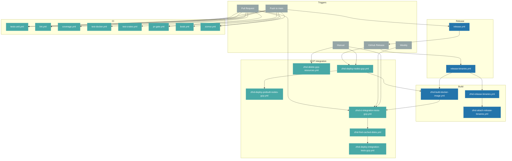

# Zebra CI/CD Architecture

This document provides a comprehensive overview of Zebra's Continuous Integration and Continuous Deployment (CI/CD) system. It serves as a guide for contributors, maintainers, and new team members.

## Table of Contents

1. [System Overview](#system-overview)
2. [CI/CD Workflow Diagram](#cicd-workflow-diagram)
3. [Core Infrastructure](#core-infrastructure)
4. [Workflow Organization](#workflow-organization)
5. [Test Execution Strategy](#test-execution-strategy)
6. [Infrastructure Details](#infrastructure-details)
7. [Best Practices](#best-practices)
8. [Known Issues](#known-issues)

## System Overview

Zebra's CI/CD system is built on GitHub Actions, providing a unified platform for automation. The system ensures code quality, maintains stability, and automates routine tasks through specialized workflows.

## CI/CD Workflow Diagram

Below is a simplified Mermaid diagram showing the current workflows, their key triggers, and major dependencies.


```mermaid
graph TB
  %% Triggers
  subgraph Triggers
    PR[Pull Request] & Push[Push to main] & ReleaseEvent[GitHub Release] & Schedule[Weekly] & Manual[Manual]
  end

  %% Reusable build
  subgraph Build
    BuildDocker[zfnd-build-docker-image.yml]
    PrepareBinaries[zfnd-release-binaries.yml]
    AttachBinaries[zfnd-attach-release-binaries.yml]
  end

  %% Release automation
  subgraph Release
    ReleaseWorkflow[release.yml]
    ReleaseBinaries[release-binaries.yml]
  end

  %% CI workflows
  subgraph CI
    Unit[tests-unit.yml]
    Lint[lint.yml]
    Coverage[coverage.yml]
    DockerCfg[test-docker.yml]
    CrateBuild[test-crates.yml]
    PRGate[pr-gate.yml]
    Docs[book.yml]
    Security[zizmor.yml]
  end

  %% Integration tests on GCP
  subgraph GCP Integration
    IT[zfnd-ci-integration-tests-gcp.yml]
    FindDisks[zfnd-find-cached-disks.yml]
    Deploy[zfnd-deploy-integration-tests-gcp.yml]
    DeployNodes[zfnd-deploy-nodes-gcp.yml]
    DeployPrebuilt[zfnd-deploy-prebuilt-nodes-gcp.yml]
    Cleanup[zfnd-delete-gcp-resources.yml]
  end

  %% Trigger wiring
  PR --> Unit & Lint & DockerCfg & CrateBuild & PRGate & IT & Security
  Push --> Unit & Lint & Coverage & PRGate & Docs & Security & ReleaseWorkflow
  ReleaseWorkflow --> ReleaseEvent
  ReleaseEvent --> ReleaseBinaries & DeployNodes
  Schedule --> IT
  Manual --> IT & DeployNodes & Cleanup

  %% Build dependency
  ReleaseBinaries --> BuildDocker & PrepareBinaries
  PrepareBinaries --> AttachBinaries
  BuildDocker --> IT
  IT --> FindDisks --> Deploy
  DeployNodes --> BuildDocker
  DeployNodes --> DeployPrebuilt

  %% Styling
  classDef primary fill:#2374ab,stroke:#2374ab,color:white
  classDef secondary fill:#48a9a6,stroke:#48a9a6,color:white
  classDef trigger fill:#95a5a6,stroke:#95a5a6,color:white
  class BuildDocker,PrepareBinaries,AttachBinaries primary
  class ReleaseWorkflow,ReleaseBinaries primary
  class Unit,Lint,Coverage,DockerCfg,CrateBuild,PRGate,Docs,Security secondary
  class IT,FindDisks,Deploy,DeployNodes,DeployPrebuilt,Cleanup secondary
  class PR,Push,ReleaseEvent,Schedule,Manual trigger
```

_The diagram above illustrates the parallel execution patterns in our CI/CD system. All triggers can initiate the pipeline concurrently, unit tests run in parallel after the Docker image build, and integration tests follow a mix of parallel and sequential steps. The infrastructure components support their respective workflow parts concurrently._

## Core Infrastructure

### 1. GitHub Actions

- Primary CI/CD platform
- Workflow automation and orchestration
- Integration with other services

### 2. Infrastructure as Code

- Uses [Cloud Foundation Fabric](https://github.com/ZcashFoundation/cloud-foundation-fabric) for GCP infrastructure
- Terraform-based architecture, networking, and permissions
- Resources (VMs, Disks, Images, etc.) deployed via GitHub Actions pipelines

### 3. Build and Registry Services

#### Docker-based Testing

- Most tests run in containers defined by our [Dockerfile](../../docker/Dockerfile)
- The [entrypoint script](../../docker/entrypoint.sh) manages:
  - Test execution
  - Environment configuration
  - Resource cleanup

#### [Docker Build Cloud](https://www.docker.com/products/build-cloud/)

- Optimized build times (~10 min for non-cached, ~30 sec for cached)
- More efficient than GitHub Runners
- Addresses [Rust caching limitations](https://github.com/ZcashFoundation/zebra/issues/6169#issuecomment-1712776391)

#### Container Registries

- Google Cloud Registry: Internal CI artifacts
- [Docker Hub](https://hub.docker.com/): Public release artifacts
- Ensures proper artifact distribution

### 4. Test Infrastructure

#### GitHub-hosted Runners

- All Unit Tests jobs
- Standard CI/CD operations
- Limited to 6-hour runtime

#### Self-hosted Runners (GKE)

- All Integration Tests jobs (deployed to GCP)
- Support for tests exceeding 6 hours
- Extended logging capabilities
- Full GitHub Actions console integration

**Note**: Self-hosted Runners are just used to keep the logs running in the GitHub Actions UI for over 6 hours, the Integration Tests are not run in the Self-hosted Runner itself, but in the deployed VMs in GCP through GitHub Actions.

### 5. Rust build caching

Rust jobs cache `~/.cargo` and dependency artifacts in `target/` through
[`actions-rust-lang/setup-rust-toolchain`](https://github.com/actions-rust-lang/setup-rust-toolchain),
which wraps [`Swatinem/rust-cache`](https://github.com/Swatinem/rust-cache). Caching is on by
default, so a job opts _out_ with `cache: false` rather than opting in.

GitHub gives each repository 10 GB of cache storage by default; administrators can configure a
higher paid limit. Least-recently-used entries are evicted when the configured limit is exceeded.
Caches are also branch-scoped: a branch can read its own caches and the default branch's,
caches written by PRs can never be read by anyone else, but they still evict main's caches, which
are the only ones every PR does restore from.

Three rules keep the quota usable:

1. **Only main writes.** The main building jobs set
   `cache-save-if: ${{ github.ref == 'refs/heads/main' }}`. PRs restore from main and write nothing. (There are some minor exceptions to this rule.)
2. **Wide matrices share one key.** The `test-crates.yml` matrices use
   `cache-shared-key` and seed the shared cache from a single build (`zebrad`
   which has the widest dependency closure; `zebra-rpc` for the MSRV build since
   it does not build `zebrad` and `zebra-rpc` is second widest option).
3. **Jobs that don't build don't cache.** `fmt`, `no-test-deps`, `deny` (12 jobs wide), and the
   crate-matrix generator in `test-crates.yml` set `cache: false`.

To inspect the current state:

```bash
gh api repos/ZcashFoundation/zebra/actions/cache/usage
gh api 'repos/ZcashFoundation/zebra/actions/caches?per_page=100' \
  --jq '[.actions_caches[] | {ref, mb: (.size_in_bytes/1048576|round)}]
        | group_by(.ref)[] | "\(.[0].ref) n=\(length) \(map(.mb)|add)MB"'
```

### 6. Queue Management

[GitHub merge queue](https://docs.github.com/en/repositories/configuring-branches-and-merges-in-your-repository/configuring-pull-request-merges/managing-a-merge-queue)

- After approving a green pull request, a Zebra maintainer selects **Merge when
  ready**. Fork authors and other contributors do not need write access to the queue.
- The queue is configured on the `PR Requirements` ruleset, not in a file:

  | Setting | Value |
  | --- | --- |
  | Merge method | `MERGE` |
  | Build concurrency | `5` |
  | Grouping strategy | `ALLGREEN` |
  | Check response timeout | `180 minutes` |
  | Minimum pull requests to merge | `1` |
  | Maximum pull requests to merge | `1` |
  | Wait time | `2 minutes` |

  The `MERGE` method is what gives each pull request its own merge commit; the merge
  limits only throttle how many already-validated entries merge at once. They do not
  batch CI builds: GitHub validates cumulative merge-group branches, while Mergify
  created explicit batches and split failed batches to find the failing pull request.
- Every required-check workflow must keep its `merge_group` trigger and its aggregator
  job name, or the queue stalls waiting for a check that is never reported
- `merge-policy` holds a pull request carrying `do-not-merge`; the Merge Freeze app's
  `mergefreeze` status holds the repository during a release window. Neither is
  enforced until the queue is activated — see [Activating the
  queue](../../book/src/dev/continuous-integration.md#activating-the-queue)

GitHub's queue is FIFO, with a manual jump-to-top operation that rebuilds affected
entries. Moving from Mergify intentionally removes automatic enrollment, high and low
priority rules, CI batching and bisection, and Mergify's queue dashboard and statistics.

## Workflow Organization

### Main Workflows

- **Unit Tests** (`tests-unit.yml`): OS matrix unit tests via nextest
- **Lint** (`lint.yml`): Clippy, fmt, deny, features, docs build checks
- **Coverage** (`coverage.yml`): llvm-cov with nextest, uploads to Codecov
- **Test Docker Config** (`test-docker.yml`): Validates zebrad configs against built test image
- **Test Crate Build** (`test-crates.yml`): Builds each crate under various feature sets
- **PR Gate** (`pr-gate.yml`): Validates PR declarations, changelog policy, API compatibility, and complete generated Release PR readiness
- **Merge Policy** (`merge-policy.yml`): Fast required check for the `do-not-merge` label
- **Docs (Book + internal)** (`book.yml`): Builds mdBook and internal rustdoc, publishes to Pages
- **Security Analysis** (`zizmor.yml`): GitHub Actions security lint (SARIF)
- **Release** (`release.yml`): Creates or updates Release PRs with release-plz, then uses `ZcashFoundation/cargo-release` and native Cargo to reconcile crates, tags, and one `zebrad` GitHub Release. See the [release process](../../book/src/dev/release-process.md#release-candidate--release-process) for operational instructions.
- **Release Binaries** (`release-binaries.yml`): Orchestrates release images, prepares and attaches downloadable binaries, and supports manual preparation validation without release attachment
- **Integration Tests on GCP** (`zfnd-ci-integration-tests-gcp.yml`): Stateful tests, E2E tests, cached disks, lwd flows

### Supporting/Reusable Workflows

- **Build docker image** (`zfnd-build-docker-image.yml`): Reusable image build with caching and tagging
- **Prepare release binaries** (`zfnd-release-binaries.yml`): Builds, attests, checksums, signs, and uploads the immutable binary bundle
- **Attach release binaries** (`zfnd-attach-release-binaries.yml`): Attaches the prepared binary bundle to an existing GitHub Release
- **Find cached disks** (`zfnd-find-cached-disks.yml`): Discovers GCP disks for stateful tests
- **Deploy integration tests** (`zfnd-deploy-integration-tests-gcp.yml`): Orchestrates GCP VMs and test runs
- **Deploy nodes** (`zfnd-deploy-nodes-gcp.yml`): Build the event-specific image and orchestrate long-lived node deployment
- **Deploy prebuilt nodes** (`zfnd-deploy-prebuilt-nodes-gcp.yml`): Deploy an explicit immutable GAR image identity
- **Delete GCP resources** (`zfnd-delete-gcp-resources.yml`): Cleanup utilities
- Helper scripts in `.github/workflows/scripts/` used by the above

Required-check workflows follow a `changes` (paths-filter) + gated workers + aggregator pattern. File-to-workflow mapping lives in [`.github/path-filters.yml`](../path-filters.yml). The aggregator job ID matches the workflow basename and the GitHub ruleset context (`lint`, `unit-tests`, `test-crates`, ...). See [`book/src/dev/continuous-integration.md`](../../book/src/dev/continuous-integration.md).

## Test Execution Strategy

### Test Orchestration with Nextest

Our test execution is centralized through our Docker [entrypoint script](../../docker/entrypoint.sh) and orchestrated by `cargo nextest`. This provides a unified and efficient way to run tests both in CI and locally.

#### Nextest Profile-driven Testing

We use `nextest` profiles defined in [`.config/nextest.toml`](../../.config/nextest.toml) to manage test suites. A single environment variable, `NEXTEST_PROFILE`, selects the profile to run.

```bash
# Run unit + integration tests using the 'ci' profile
docker run --rm -e NEXTEST_PROFILE=ci zebra-tests

# Run a specific stateful test on GCP
docker run --rm -e NEXTEST_PROFILE=ci-stateful -e "NEXTEST_FILTER=test(=stateful::sync::sync_update_mainnet)" zebra-tests

# Run a specific E2E test on GCP
docker run --rm -e NEXTEST_PROFILE=ci-e2e -e "NEXTEST_FILTER=test(=e2e::sync::sync_full_mainnet)" zebra-tests
```

#### Test Categories

The canonical test tier definitions and local nextest examples live in
[`zebrad/tests/main.rs`](../../zebrad/tests/main.rs). The nextest profile filters
live in [`.config/nextest.toml`](../../.config/nextest.toml).

The `ci` profile runs the fast PR test set. The `ci-stateful` and `ci-e2e`
profiles are used on GCP VMs with `NEXTEST_FILTER` selecting specific tests.

### Pull Request Testing

#### Continuous Validation

- Tests run automatically on each commit
- Contributors get immediate feedback on their changes
- Regressions are caught early in the development process
- Reduces manual testing burden on reviewers

#### Fast Feedback Loop

- Linting: Code style and formatting
- Unit tests: Function and component behavior
- Basic integration tests: Core functionality
- All results are reported directly in the PR interface

#### Deep Validation

- Full integration test suite
- Cross-platform compatibility checks
- Performance benchmarks
- State management validation

### Scheduled Testing

Weekly runs include:

- Full Mainnet synchronization
- Extended integration suites
- Resource cleanup

## Infrastructure Details

### VM-based Test Infrastructure

#### Test-specific Requirements

- Some integration tests need a fully synced network
- Certain tests validate against specific chain heights
- Network state persistence between test runs
- Not all tests require this infrastructure - many run in standard containers

#### State Management Complexity

- **Creation**: Initial sync and state building for test environments
- **Versioning**: Multiple state versions for different test scenarios
- **Caching**: Reuse of existing states to avoid re-sync
- **Attachment**: Dynamic VM disk mounting for tests
- **Cleanup**: Automated state and resource cleanup

#### Infrastructure Implications

- GCP VM infrastructure for state-dependent tests
- Complex disk image management for test states
- State versioning and compatibility checks
- Resource lifecycle management

#### Future Considerations

- Potential migration of state-dependent tests to container-native environments
- Would require solving state persistence in Kubernetes
- Need to balance containerization benefits with test requirements
- Opportunity to reduce infrastructure complexity

## Best Practices

### For Contributors

#### Local Testing

```bash
# Build and run tests
docker build -t zebra-tests --target tests .
docker run --rm zebra-tests
```

#### PR Guidelines

- Use descriptive labels
- Mark as draft when needed
- Address test failures

### For Maintainers

#### Workflow Maintenance

- Regular review of workflow efficiency
- Update resource allocations as needed
- Monitor test execution times

#### Security Considerations

- Regular secret rotation
- Access control review
- Dependency updates

## Known Issues

### External Contributor Limitations

#### GCP Dependencies

- Most CI workflows depend on Google Cloud Platform resources
- Docker artifacts and VM images are tied to GCP
- External contributors cannot run full CI suite in their forks
- Integration tests require GCP infrastructure access
- This particularly impacts:
  - Integration test execution
  - Node deployment testing
  - State storage and caching validation

#### GitHub Actions Variables Restriction

- Due to a [GitHub Actions limitation](https://github.com/orgs/community/discussions/44322), workflows in forked repositories cannot access repository variables
- This affects external contributors' ability to run CI workflows
- Required configuration values are not available in fork-based PRs
- Currently no workaround available from GitHub
- Impact on external contributors:
  - Cannot run workflows requiring GCP credentials
  - Unable to access configuration variables
  - Limited ability to test infrastructure changes

### Mitigation Through the Merge Queue

- `merge_group` runs execute in the context of this repository, not the fork, so the
  required checks do get full access to secrets and repository variables before a fork
  PR reaches `main`
- This covers the repository-owned checks (`lint`, `unit-tests`, `test-crates`,
  `pr-gate-result`, and `merge-policy`); Merge Freeze separately reports its
  `mergefreeze` status on the merge group

It does **not** cover the GCP integration tests: `trigger-integration-tests.yml` runs on
`pull_request` and `push` only, so a fork PR still needs a maintainer to dispatch it
manually with the PR number.
