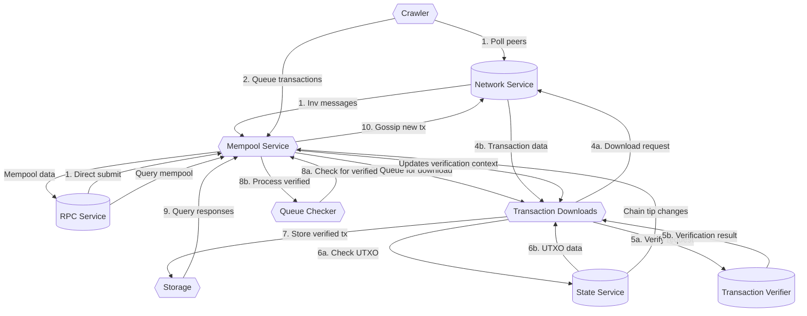

# Mempool Architecture Diagram

This diagram illustrates the architecture of the Zebra mempool, showing its main components and the flow of transactions through the system.

## Component Descriptions

1. **Mempool Service**: Central coordinator handling requests and managing mempool state.

2. **Storage**: In-memory storage for verified and rejected transactions.

3. **Transaction Downloads**: Handles downloading and verifying transactions.

4. **Crawler**: Polls peers for new transactions.

5. **Queue Checker**: Polls for newly verified transactions.

## Transaction Flow

1. Transactions arrive via network gossiping, direct RPC submission, or crawler polling.

2. Mempool checks if transactions are known or rejected, queues new ones for download.

3. Download service retrieves transaction data from peers.

4. Transactions are verified against consensus rules.

5. Verified transactions are stored and gossiped to peers.

6. Queue checker regularly checks for newly verified transactions.

7. Transactions remain in mempool until mined or evicted.

8. Chain tip changes trigger verification context updates. 
