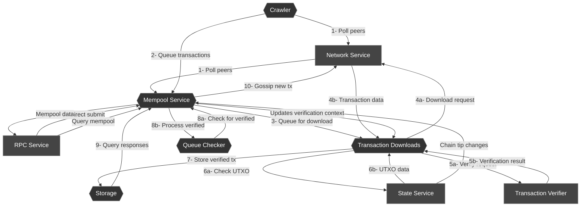

# Mempool Architecture Diagram

This diagram illustrates the architecture of the Zebra mempool, showing its main components and the flow of transactions through the system.

## Component Descriptions

1. **Mempool Service**: The central coordinator that handles requests and manages the mempool state.

2. **Storage**: In-memory storage for verified transactions and rejection lists.

3. **Transaction Downloads**: Handles downloading and verifying transactions from peers.

4. **Crawler**: Periodically polls peers for new transactions.

5. **Queue Checker**: Regularly polls for newly verified transactions.

## Transaction Flow

1. Transactions arrive via network gossiping, direct RPC submission, or crawler polling.

2. The mempool checks if transactions are already known or rejected. If not, it queues them for download.

3. The download service retrieves transaction data from peers.

4. Transactions are verified against consensus rules using the transaction verifier.

5. Verified transactions are stored in memory and gossiped to peers.

6. The queue checker regularly checks for newly verified transactions.

7. Transactions remain in the mempool until they are mined or evicted due to size limits.

8. When the chain tip changes, the mempool updates its verification context and potentially evicts invalid transactions.
