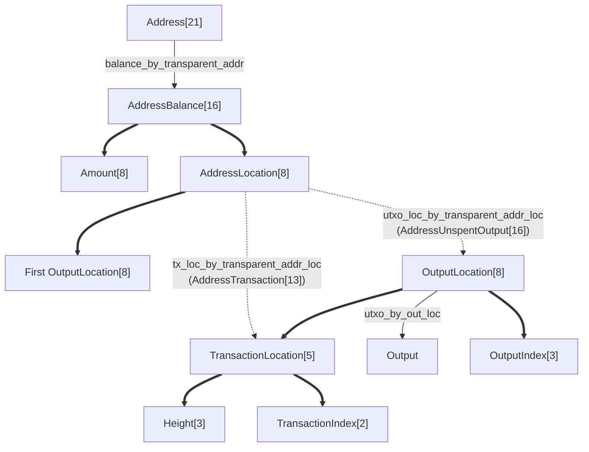

# Zebra Cached State Database Implementation

## Upgrading the State Database

For most state upgrades, we want to modify the database format of the existing database. If we
change the major database version, every user needs to re-download and re-verify all the blocks,
which can take days.

### In-Place Upgrade Goals

- avoid a full download and rebuild of the state
- the previous state format must be able to be loaded by the new state
  - this is checked the first time CI runs on a PR with a new state version.
    After the first CI run, the cached state is marked as upgraded, so the upgrade doesn't run
    again. If CI fails on the first run, any cached states with that version should be deleted.
- previous zebra versions should be able to load the new format
  - this is checked by other PRs running using the upgraded cached state, but only if a Rust PR
    runs after the new PR's CI finishes, but before it merges
- best-effort loading of older supported states by newer Zebra versions
- best-effort compatibility between newer states and older supported Zebra versions

### Design Constraints
[design]: #design

Upgrades run concurrently with state verification and RPC requests.

This means that:
- the state must be able to read the old and new formats
  - it can't panic if the data is missing
  - it can't give incorrect results, because that can affect verification or wallets
  - it can return an error
  - it can only return an `Option` if the caller handles it correctly
- multiple upgrades must produce a valid state format
  - if Zebra is restarted, the format upgrade will run multiple times
  - if an older Zebra version opens the state, data can be written in an older format
- the format must be valid before and after each database transaction or API call, because an upgrade can be cancelled at any time
  - multi-column family changes should made in database transactions
  - if you are building new column family, disable state queries, then enable them once it's done
  - if each database API call produces a valid format, transactions aren't needed

If there is an upgrade failure, it can panic and tell the user to delete their cached state and re-launch Zebra.

### Performance Constraints

Some column family access patterns can lead to very poor performance.

Known performance issues include:
- using an iterator on a column family which also deletes keys
- creating large numbers of iterators
- holding an iterator for a long time

See the performance notes and bug reports in:
- https://github.com/facebook/rocksdb/wiki/Iterator#iterating-upper-bound-and-lower-bound
- https://tracker.ceph.com/issues/55324
- https://jira.mariadb.org/browse/MDEV-19670

But we need to use iterators for some operations, so our alternatives are (in preferred order):
1. Minimise the number of keys we delete, and how often we delete them
2. Avoid using iterators on column families where we delete keys
3. If we must use iterators on those column families, set read bounds to minimise the amount of deleted data that is read

Currently only UTXOs require key deletion, and only `utxo_loc_by_transparent_addr_loc` requires
deletion and iterators.

### Implementation Steps

- [ ] update the [database format](https://github.com/ZcashFoundation/zebra/blob/main/book/src/dev/state-db-upgrades.md#current) in the Zebra docs
- [ ] increment the state minor version
- [ ] write the new format in the block write task
- [ ] update older formats in the format upgrade task
- [ ] test that the new format works when creating a new state, and updating an older state

See the [upgrade design docs](https://github.com/ZcashFoundation/zebra/blob/main/book/src/dev/state-db-upgrades.md#design) for more details.

These steps can be copied into tickets.

## Current State Database Format
[current]: #current

rocksdb provides a persistent, thread-safe `BTreeMap<&[u8], &[u8]>`. Each map is
a distinct "tree". Keys are sorted using lexographic order (`[u8].sorted()`) on byte strings, so
integer values should be stored using big-endian encoding (so that the lex
order on byte strings is the numeric ordering).

Note that the lex order storage allows creating 1-to-many maps using keys only.
For example, the `tx_loc_by_transparent_addr_loc` allows mapping each address
to all transactions related to it, by simply storing each transaction prefixed
with the address as the key, leaving the value empty. Since rocksdb allows
listing all keys with a given prefix, it will allow listing all transactions
related to a given address.

We use the following rocksdb column families:

| Column Family                      | Keys                   | Values                        | Changes |
| ---------------------------------- | ---------------------- | ----------------------------- | ------- |
| *Blocks*                           |                        |                               |         |
| `hash_by_height`                   | `block::Height`        | `block::Hash`                 | Create  |
| `height_by_hash`                   | `block::Hash`          | `block::Height`               | Create  |
| `block_header_by_height`           | `block::Height`        | `block::Header`               | Create  |
| *Transactions*                     |                        |                               |         |
| `tx_by_loc`                        | `TransactionLocation`  | `Transaction`                 | Create  |
| `hash_by_tx_loc`                   | `TransactionLocation`  | `transaction::Hash`           | Create  |
| `tx_loc_by_hash`                   | `transaction::Hash`    | `TransactionLocation`         | Create  |
| *Transparent*                      |                        |                               |         |
| `balance_by_transparent_addr`      | `transparent::Address` | `Amount \|\| AddressLocation` | Update  |
| `tx_loc_by_transparent_addr_loc`   | `AddressTransaction`   | `()`                          | Create  |
| `utxo_by_out_loc`                  | `OutputLocation`       | `transparent::Output`         | Delete  |
| `utxo_loc_by_transparent_addr_loc` | `AddressUnspentOutput` | `()`                          | Delete  |
| *Sprout*                           |                        |                               |         |
| `sprout_nullifiers`                | `sprout::Nullifier`    | `()`                          | Create  |
| `sprout_anchors`                   | `sprout::tree::Root`   | `sprout::NoteCommitmentTree`  | Create  |
| `sprout_note_commitment_tree`      | `()`                   | `sprout::NoteCommitmentTree`  | Update  |
| *Sapling*                          |                        |                               |         |
| `sapling_nullifiers`               | `sapling::Nullifier`   | `()`                          | Create  |
| `sapling_anchors`                  | `sapling::tree::Root`  | `()`                          | Create  |
| `sapling_note_commitment_tree`     | `block::Height`        | `sapling::NoteCommitmentTree` | Create  |
| `sapling_note_commitment_subtree`  | `block::Height`        | `NoteCommitmentSubtreeData`   | Create  |
| *Orchard*                          |                        |                               |         |
| `orchard_nullifiers`               | `orchard::Nullifier`   | `()`                          | Create  |
| `orchard_anchors`                  | `orchard::tree::Root`  | `()`                          | Create  |
| `orchard_note_commitment_tree`     | `block::Height`        | `orchard::NoteCommitmentTree` | Create  |
| `orchard_note_commitment_subtree`  | `block::Height`        | `NoteCommitmentSubtreeData`   | Create  |
| *Chain*                            |                        |                               |         |
| `history_tree`                     | `()`                   | `NonEmptyHistoryTree`         | Update  |
| `tip_chain_value_pool`             | `()`                   | `ValueBalance`                | Update  |

Zcash structures are encoded using `ZcashSerialize`/`ZcashDeserialize`.
Other structures are encoded using `IntoDisk`/`FromDisk`.

Block and Transaction Data:
- `Height`: 24 bits, big-endian, unsigned (allows for ~30 years worth of blocks)
- `TransactionIndex`: 16 bits, big-endian, unsigned (max ~23,000 transactions in the 2 MB block limit)
- `TransactionCount`: same as `TransactionIndex`
- `TransactionLocation`: `Height \|\| TransactionIndex`
- `OutputIndex`: 24 bits, big-endian, unsigned (max ~223,000 transfers in the 2 MB block limit)
- transparent and shielded input indexes, and shielded output indexes: 16 bits, big-endian, unsigned (max ~49,000 transfers in the 2 MB block limit)
- `OutputLocation`: `TransactionLocation \|\| OutputIndex`
- `AddressLocation`: the first `OutputLocation` used by a `transparent::Address`.
  Always has the same value for each address, even if the first output is spent.
- `Utxo`: `Output`, derives extra fields from the `OutputLocation` key
- `AddressUnspentOutput`: `AddressLocation \|\| OutputLocation`,
  used instead of a `BTreeSet<OutputLocation>` value, to improve database performance
- `AddressTransaction`: `AddressLocation \|\| TransactionLocation`
  used instead of a `BTreeSet<TransactionLocation>` value, to improve database performance
- `NoteCommitmentSubtreeIndex`: 16 bits, big-endian, unsigned
- `NoteCommitmentSubtreeData<{sapling, orchard}::tree::Node>`: `Height \|\| {sapling, orchard}::tree::Node`

We use big-endian encoding for keys, to allow database index prefix searches.

Amounts:
- `Amount`: 64 bits, little-endian, signed
- `ValueBalance`: `[Amount; 4]`

Derived Formats:
- `*::NoteCommitmentTree`: `bincode` using `serde`
  - stored note commitment trees always have cached roots
- `NonEmptyHistoryTree`: `bincode` using `serde`, using `zcash_history`'s `serde` implementation

The following figure helps visualizing the address index, which is the most complicated part.
Numbers in brackets are array sizes; bold arrows are compositions (i.e. `TransactionLocation` is the
concatenation of `Height` and `TransactionIndex`); dashed arrows are compositions that are also 1-to-many
maps (i.e. `AddressTransaction` is the concatenation of `AddressLocation` and `TransactionLocation`,
but also is used to map each `AddressLocation` to multiple `TransactionLocation`s).

### Implementing consensus rules using rocksdb
[rocksdb-consensus-rules]: #rocksdb-consensus-rules

Each column family handles updates differently, based on its specific consensus rules:
- Create:
  - Each key-value entry is created once.
  - Keys are never deleted, values are never updated.
- Delete:
  - Each key-value entry is created once.
  - Keys can be deleted, but values are never updated.
  - Code called by ReadStateService must ignore deleted keys, or use a read lock.
  - TODO: should we prevent re-inserts of keys that have been deleted?
- Update:
  - Each key-value entry is created once.
  - Keys are never deleted, but values can be updated.
  - Code called by ReadStateService must handle old or new values, or use a read lock.

We can't do some kinds of value updates, because they cause RocksDB performance issues:
- Append:
  - Keys are never deleted.
  - Existing values are never updated.
  - Sets of values have additional items appended to the end of the set.
  - Code called by ReadStateService must handle shorter or longer sets, or use a read lock.
- Up/Del:
  - Keys can be deleted.
  - Sets of values have items added or deleted (in any position).
  - Code called by ReadStateService must ignore deleted keys and values,
    accept shorter or longer sets, and accept old or new values.
    Or it should use a read lock.

Avoid using large sets of values as RocksDB keys or values.

### RocksDB read locks
[rocksdb-read-locks]: #rocksdb-read-locks

The read-only ReadStateService needs to handle concurrent writes and deletes of the finalized
column families it reads. It must also handle overlaps between the cached non-finalized `Chain`,
and the current finalized state database.

The StateService uses RocksDB transactions for each block write.
So ReadStateService queries that only access a single key or value will always see
a consistent view of the database.

If a ReadStateService query only uses column families that have keys and values appended
(`Never` in the Updates table above), it should ignore extra appended values.
Most queries do this by default.

For more complex queries, there are several options:

Reading across multiple column families:
1. Ignore deleted values using custom Rust code
2. Take a database snapshot - https://docs.rs/rocksdb/latest/rocksdb/struct.DBWithThreadMode.html#method.snapshot

Reading a single column family:
3. multi_get - https://docs.rs/rocksdb/latest/rocksdb/struct.DBWithThreadMode.html#method.multi_get_cf
4. iterator - https://docs.rs/rocksdb/latest/rocksdb/struct.DBWithThreadMode.html#method.iterator_cf

RocksDB also has read transactions, but they don't seem to be exposed in the Rust crate.

### Low-Level Implementation Details
[rocksdb-low-level]: #rocksdb-low-level

RocksDB ignores duplicate puts and deletes, preserving the latest values.
If rejecting duplicate puts or deletes is consensus-critical,
check [`db.get_cf(cf, key)?`](https://docs.rs/rocksdb/0.16.0/rocksdb/struct.DBWithThreadMode.html#method.get_cf)
before putting or deleting any values in a batch.

Currently, these restrictions should be enforced by code review:
- multiple `zs_insert`s are only allowed on Update column families, and
- [`delete_cf`](https://docs.rs/rocksdb/0.16.0/rocksdb/struct.WriteBatch.html#method.delete_cf)
  is only allowed on Delete column families.

In future, we could enforce these restrictions by:
- creating traits for Never, Delete, and Update
- doing different checks in `zs_insert` depending on the trait
- wrapping `delete_cf` in a trait, and only implementing that trait for types that use Delete column families.

As of June 2021, the Rust `rocksdb` crate [ignores the delete callback](https://docs.rs/rocksdb/0.16.0/src/rocksdb/merge_operator.rs.html#83-94),
and merge operators are unreliable (or have undocumented behaviour).
So they should not be used for consensus-critical checks.

### Notes on rocksdb column families
[rocksdb-column-families]: #rocksdb-column-families

- The `hash_by_height` and `height_by_hash` column families provide a bijection between
  block heights and block hashes.  (Since the rocksdb state only stores finalized
  state, they are actually a bijection).

- Similarly, the `tx_loc_by_hash` and `hash_by_tx_loc` column families provide a bijection between
  transaction locations and transaction hashes.

- The `block_header_by_height` column family provides a bijection between block
  heights and block header data. There is no corresponding `height_by_block` column
  family: instead, hash the block header, and use the hash from `height_by_hash`.
  (Since the rocksdb state only stores finalized state, they are actually a bijection).
  Similarly, there are no column families that go from transaction data
  to transaction locations: hash the transaction and use `tx_loc_by_hash`.

- Block headers and transactions are stored separately in the database,
  so that individual transactions can be accessed efficiently.
  Blocks can be re-created on request using the following process:
  - Look up `height` in `height_by_hash`
  - Get the block header for `height` from `block_header_by_height`
  - Iterate from `TransactionIndex` 0,
    to get each transaction with `height` from `tx_by_loc`,
    stopping when there are no more transactions in the block

- Block headers are stored by height, not by hash.  This has the downside that looking
  up a block by hash requires an extra level of indirection.  The upside is
  that blocks with adjacent heights are adjacent in the database, and many
  common access patterns, such as helping a client sync the chain or doing
  analysis, access blocks in (potentially sparse) height order.  In addition,
  the fact that we commit blocks in order means we're writing only to the end
  of the rocksdb column family, which may help save space.

- Similarly, transaction data is stored in chain order in `tx_by_loc` and `utxo_by_out_loc`,
  and chain order within each vector in `utxo_loc_by_transparent_addr_loc` and
  `tx_loc_by_transparent_addr_loc`.

- `TransactionLocation`s are stored as a `(height, index)` pair referencing the
  height of the transaction's parent block and the transaction's index in that
  block.  This would more traditionally be a `(hash, index)` pair, but because
  we store blocks by height, storing the height saves one level of indirection.
  Transaction hashes can be looked up using `hash_by_tx_loc`.

- Similarly, UTXOs are stored in `utxo_by_out_loc` by `OutputLocation`,
  rather than `OutPoint`. `OutPoint`s can be looked up using `tx_loc_by_hash`,
  and reconstructed using `hash_by_tx_loc`.

- The `Utxo` type can be constructed from the `OutputLocation` and `Output` data,
  `height: OutputLocation.height`, and
  `is_coinbase: OutputLocation.transaction_index == 0`
  (coinbase transactions are always the first transaction in a block).

- `balance_by_transparent_addr` is the sum of all `utxo_loc_by_transparent_addr_loc`s
  that are still in `utxo_by_out_loc`. It is cached to improve performance for
  addresses with large UTXO sets. It also stores the `AddressLocation` for each
  address, which allows for efficient lookups.

- `utxo_loc_by_transparent_addr_loc` stores unspent transparent output locations
  by address. The address location and UTXO location are stored as a RocksDB key,
  so they are in chain order, and get good database performance.
  This column family includes also includes the original address location UTXO,
  if it has not been spent.

- When a block write deletes a UTXO from `utxo_by_out_loc`,
  that UTXO location should be deleted from `utxo_loc_by_transparent_addr_loc`.
  The deleted UTXO can be removed efficiently, because the UTXO location is part of the key.
  This is an index optimisation, which does not affect query results.

- `tx_loc_by_transparent_addr_loc` stores transaction locations by address.
  This list includes transactions containing spent UTXOs.
  The address location and transaction location are stored as a RocksDB key,
  so they are in chain order, and get good database performance.
  This column family also includes the `TransactionLocation`
  of the transaction for the `AddressLocation`.

- The `sprout_note_commitment_tree` stores the note commitment tree state
  at the tip of the finalized state, for the specific pool. There is always
  a single entry. Each tree is stored
  as a "Merkle tree frontier" which is basically a (logarithmic) subset of
  the Merkle tree nodes as required to insert new items.
  For each block committed, the old tree is deleted and a new one is inserted
  by its new height.
  **TODO:** store the sprout note commitment tree by `()`,
  to avoid ReadStateService concurrent write issues.

- The `{sapling, orchard}_note_commitment_tree` stores the note commitment tree
  state for every height, for the specific pool. Each tree is stored
  as a "Merkle tree frontier" which is basically a (logarithmic) subset of
  the Merkle tree nodes as required to insert new items.

- The `{sapling, orchard}_note_commitment_subtree` stores the completion height and
  root for every completed level 16 note commitment subtree, for the specific pool.

- `history_tree` stores the ZIP-221 history tree state at the tip of the finalized
  state. There is always a single entry for it. The tree is stored as the set of "peaks"
  of the "Merkle mountain range" tree structure, which is what is required to
  insert new items.
  **TODO:** store the history tree by `()`, to avoid ReadStateService concurrent write issues.

- Each `*_anchors` stores the anchor (the root of a Merkle tree) of the note commitment
  tree of a certain block. We only use the keys since we just need the set of anchors,
  regardless of where they come from. The exception is `sprout_anchors` which also maps
  the anchor to the matching note commitment tree. This is required to support interstitial
  treestates, which are unique to Sprout.
  **TODO:** store the `Root` hash in `sprout_note_commitment_tree`, and use it to look up the
  note commitment tree. This de-duplicates tree state data. But we currently only store one sprout tree by height.

- The value pools are only stored for the finalized tip.

- We do not store the cumulative work for the finalized chain,
  because the finalized work is equal for all non-finalized chains.
  So the additional non-finalized work can be used to calculate the relative chain order,
  and choose the best chain.
