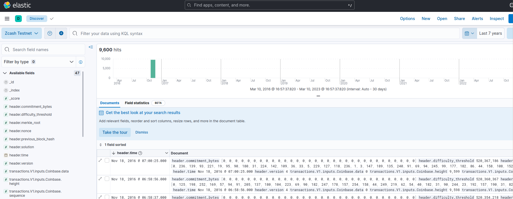
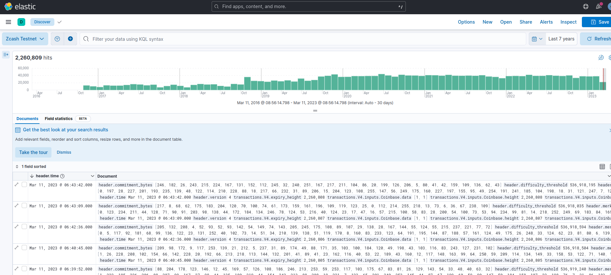
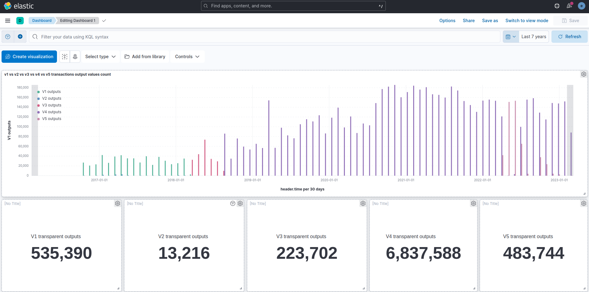

# Kibana blockchain explorer

The goal here is to export block data from Zebra into an [elasticsearch](https://www.elastic.co/) database and visualize it with the [kibana](https://www.elastic.co/kibana/) front end.

**Attention:** This is an experimental feature tested only in the Zcash Testnet.

Elasticsearch support was introduced to Zebra in [pull request #6274](https://github.com/ZcashFoundation/zebra/pull/6274).

## Download, build and run Elasticsearch

Installing elasticsearch is easy in linux and macOS by following the [.tar.gz installation guide](https://www.elastic.co/guide/en/elasticsearch/reference/current/targz.html).

Make sure you end up with an `elasticsearch` binary. Run it:

```sh
./bin/elasticsearch
```

The first time you run the database, `elastic` password and the enrollment token for Kibana will displayed in the screen (See the [Elasticsearch running guide](https://www.elastic.co/guide/en/elasticsearch/reference/current/targz.html#targz-running)). Please save these as you will need them.

Elasticsearch will listen in <https://localhost:9200> by default.

## Download, build and run Kibana

Installing kibana is also easy in linux and macOS following the [.tar.gz installation guide](https://www.elastic.co/guide/en/kibana/current/targz.html).

Make sure you end up with a `kibana` binary and run it:

```sh
./bin/kibana
```

The first time you run kibana, it will provide a link for configuration:

```sh
Kibana has not been configured.

Go to http://localhost:5601/?code=405316 to get started.
```

Visit the url to get started, you will need the kibana enrollment token from elasticsearch and the elastic password from the previous step.

Kibana will listen in <https://localhost:5601> by default.

You are now ready to start bumping data into elasticsearch with Zebra.

## Download and build zebra with `elasticsearch` feature

Elasticsearch is an optional and experimental feature, we need to build and install with the `elasticsearch` rust feature enabled using the following command:

```sh
cargo install --features elasticsearch --locked --git https://github.com/ZcashFoundation/zebra zebrad
```

Zebra binary will be at `~/.cargo/bin/zebrad`.

## Configure Zebra for `elasticsearch`

Generate a configuration file with the default settings:

```sh
zebrad generate -o ~/.config/zebrad.toml
```

The following changes are needed:

### `network` section

Change the `network` field to `Testnet`. The `Mainnet` should work but it is untested. Also ,the preferred p2p port for the testnet is 18233, so optionally change the `listen_addr` field to `0.0.0.0:18233`.

### `state` section

Add your elastic password generated when running the database for the first time into the `elasticsearch_password` field.

## Run Zebra

If the config is in the default path then just running the binary will start the sync.

```sh
zebrad
```

Sync will take time, but you can use kibana to make sure blocks are being inserted during the process.

## Visualize your data

As soon as the first batch of data is inserted from Zebra into elasticsearch database, an index `zcash_testnet` will be created.

To observe data, go to Analytics → Discover and create a new data view with the `zcash_testnet` index. Make sure you select `header.time` field as Timestamp field.

To see the data, use the calendar to get records for the last 10 years, the first blocks that are inserted will be very old blocks following the chain genesis.



After a while the chain will be in sync.



You can now use all the kibana features. For example, creating dashboards for specific data visualization.


