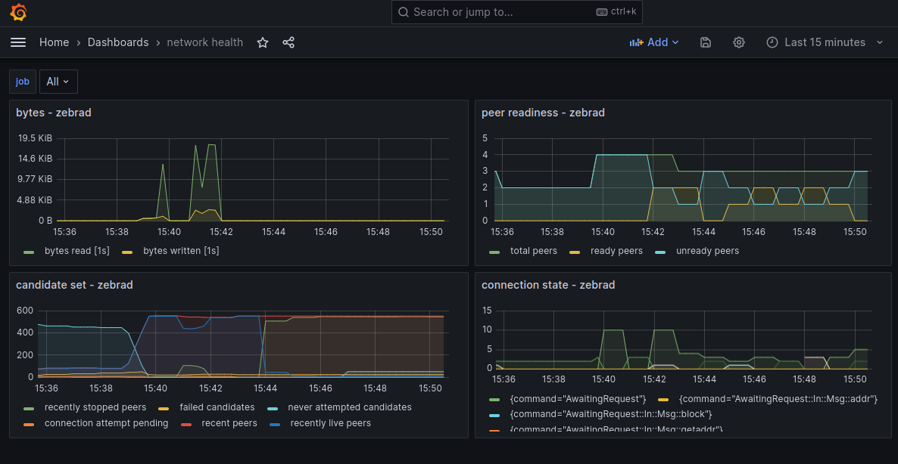

# Zebra Metrics

Zebra has support for Prometheus, configured using the `prometheus` compile-time feature,
and the [`MetricsSection`][metrics_section] runtime configuration.

The following steps can be used to send real time Zebra metrics data into a grafana
front end that you can visualize:

1. Build zebra with `prometheus` feature:

   ```bash
   cargo install --features prometheus --locked --git https://github.com/ZcashFoundation/zebra zebrad
   ```

2. Create a `zebrad.toml` file that we can edit:

   ```bash
   zebrad generate -o zebrad.toml
   ```

3. Add `endpoint_addr` to the `metrics` section:

   ```toml
   [metrics]
   endpoint_addr = "127.0.0.1:9999"
   ```

4. Run Zebra, and specify the path to the `zebrad.toml` file, for example:

   ```bash
   zebrad -c zebrad.toml start
   ```

5. Install and run Prometheus and Grafana via Docker:

   ```bash
   # create a storage volume for grafana (once)
   sudo docker volume create grafana-storage
   # create a storage volume for prometheus (once)
   sudo docker volume create prometheus-storage

   # run prometheus with the included config
   sudo docker run --detach --network host --volume prometheus-storage:/prometheus --volume /path/to/zebra/prometheus.yaml:/etc/prometheus/prometheus.yml  prom/prometheus

   # run grafana
   sudo docker run --detach --network host --env GF_SERVER_HTTP_PORT=3030 --env GF_SERVER_HTTP_ADDR=localhost --volume grafana-storage:/var/lib/grafana grafana/grafana
   ```

   Now the grafana dashboard is available at [http://localhost:3030](http://localhost:3030) ; the default username and password is `admin`/`admin`.
   Prometheus scrapes Zebra on `localhost:9999`, and provides the results on `localhost:9090`.

6. Configure Grafana with a Prometheus HTTP Data Source, using Zebra's `metrics.endpoint_addr`.

   In the grafana dashboard:
   1. Create a new Prometheus Data Source `Prometheus-Zebra`
   2. Enter the HTTP URL: `127.0.0.1:9090`
   3. Save the configuration

7. Now you can add the grafana dashboards from `zebra/docker/observability/grafana/dashboards/` (Create > Import > Upload JSON File), or create your own.



[metrics_section]: https://docs.rs/zebrad/latest/zebrad/components/metrics/struct.Config.html
