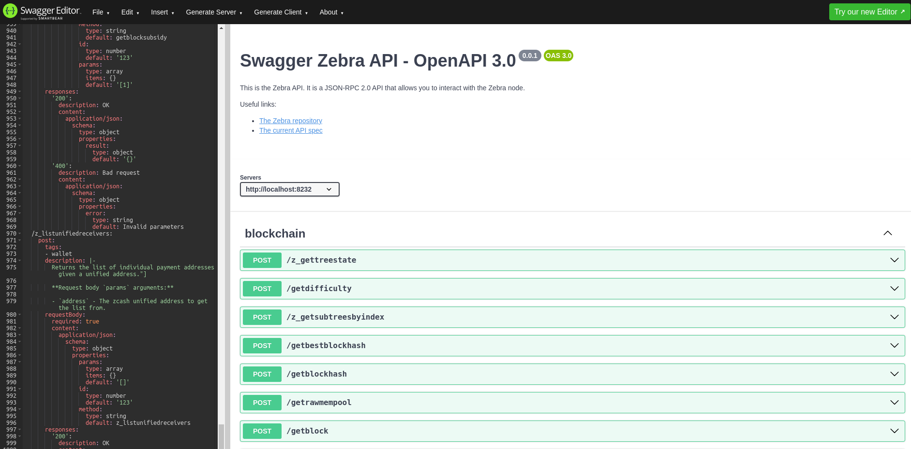
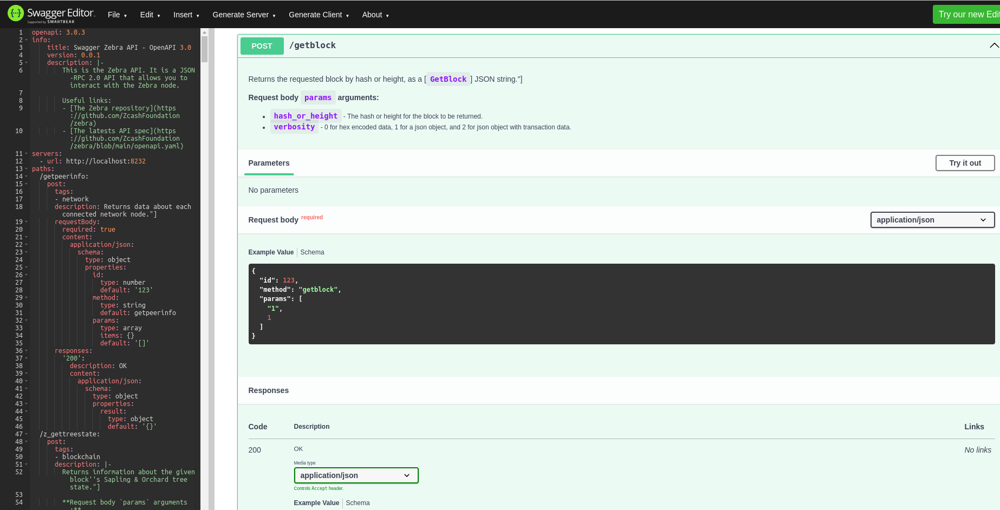
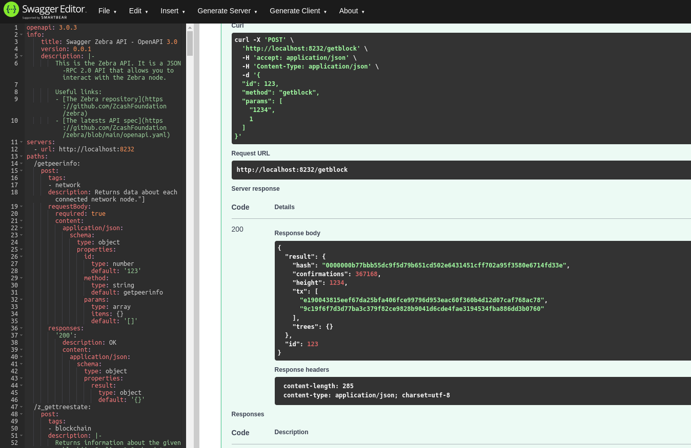

# Zebra OpenAPI specification

The Zebra RPC methods are a collection of endpoints used for interacting with the Zcash blockchain. These methods are utilized by wallets, block explorers, web and mobile applications, and more, for retrieving and sending information to the blockchain.

While the Zebra source code and RPC methods are well-documented, accessing this information typically involves searching for each function within the [Zebra crate documentation](https://docs.rs/zebrad/latest/zebrad/#zebra-crates), which may be inconvenient for users who are not familiar with Rust development.

To address this issue, the Zebra team has created an [OpenAPI](https://www.openapis.org/) specification in the [YAML](https://en.wikipedia.org/wiki/YAML) format.

The Zebra OpenAPI specification is stored in a file named openapi.yaml, located at the root of the project. The latest version of this specification will always be available [here](https://github.com/ZcashFoundation/zebra/blob/main/openapi.yaml).

## Usage

There are several ways to utilize the specification. For users unfamiliar with OpenAPI and Swagger, simply navigate to the [Swagger Editor](https://editor.swagger.io/) and paste the specification there.



To send and receive data directly from/to the blockchain within the Swagger web app, you'll need a Zebra node with the RPC endpoint enabled.

To enable this functionality, start zebrad with a custom configuration. Generate a default configuration by running the following command:

```console
mkdir -p ~/.config
zebrad generate -o ~/.config/zebrad.toml
```

Then, add the IP address and port to the `rpc` section of the configuration:

```
[rpc]
listen_addr = "127.0.0.1:8232"
```

If you modify the address and port in the Zebra configuration, ensure to update it in the `openapi.yaml` specification as well.

Start Zebra with the following command:

```console
zebrad
```

You should now be able to send requests and receive responses within Swagger.






